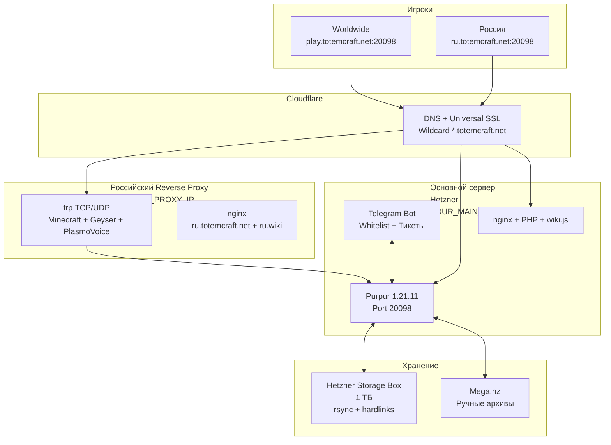
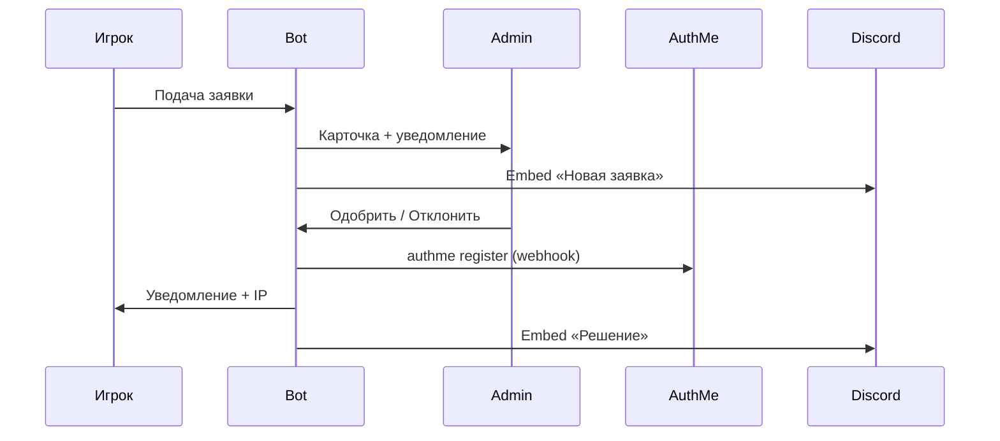

**TotemCraft - Техническая Документация**

**Версия документа: 1.0**  
**Дата актуализации: 18 мая 2026**  
**Статус: Production**  
**Владелец: Dushelow** 

**Цель документа:** Единая, актуальная, профессиональная точка знаний для владельца, администраторов и членов команды.

---

### Оглавление
- [1. Краткий обзор и ключевые факты](#1-краткий-обзор-и-ключевые-факты)
- [2. Архитектура системы и инфраструктура](#2-архитектура-системы-и-инфраструктура)
- [3. Minecraft-сервер](#3-minecraft-сервер)
  - [3.1 Основные характеристики](#31-основные-характеристики)
  - [3.2 Конфигурация ядра и механик](#32-конфигурация-ядра-и-механик)
  - [3.3 Установленные плагины](#33-установленные-плагины)
  - [3.4 Оптимизация производительности](#34-оптимизация-производительности)
  - [3.5 Anti-Xray и защита мира](#35-anti-xray-и-защита-мира)
  - [3.6 Система резервного копирования](#36-система-резервного-копирования)
- [4. Сеть, доступ и проксирование](#4-сеть-доступ-и-проксирование)
- [5. Веб-сервисы (сайт и вики)](#5-веб-сервисы-сайт-и-вики)
- [6. Деплой, запуск и управление сервером](#6-деплой-запуск-и-управление-сервером)
- [7. Геймплейные настройки и кастомные механики](#7-геймплейные-настройки-и-кастомные-механики)
- [8. Безопасность и политика реагирования](#8-безопасность-и-политика-реагирования)
- [9. Мониторинг, логи и обслуживание](#9-мониторинг-логи-и-обслуживание)
- [10. IP-адреса, порты, DNS и Cloudflare](#10-ip-адреса-порты-dns-и-cloudflare)
- [11. Приложения](#11-приложения)
- [12. История изменений документа](#12-история-изменений-документа)

---

### 1. Краткий обзор и ключевые факты

**TotemCraft** - кросплатформенный ванильный Minecraft-сервер на базе **Purpur 1.21.11**, ориентированный на стабильность, производительность и защиту от читов/грифа при полностью ванильном геймплее (без доната, рекламы, привата, телепортов, лишних плагинов и вайпов). Поддерживает мобильные клиенты, Bedrock, Java Edition, а также старые и новые версии игры, отличные от ядра сервера.

**Ключевые факты**

| Параметр            | Значение                                  | Примечание                        |
| ------------------- | ----------------------------------------- | --------------------------------- |
| Ядро                | Purpur 1.21.11                            | -                                 |
| Максимальный онлайн | 50 игроков                                | -                                 |
| Сложность           | Hard                                      | Зомби 100% заражают жителей       |
| Онлайн-режим        | false (пиратка)                           | AuthMe + Telegram-бот             |
| Миры                | 2025, 2025_nether, 2025_the_end           | Все сиды рандомизированы          |
| Ограничение мира    | 10000×10000 блоков                        | Расширяется со временем           |
| Основной адрес      | `play.totemcraft.net:20098`               | -                                 |
| Российский адрес    | `ru.totemcraft.net:20098`                 | Rus Reverse Proxy                 |
| Голосовой чат       | PlasmoVoice                               | -                                 |
| Кросс-платформа     | Geyser + Floodgate                        | -                                 |
| Anti-Xray           | Engine-mode 3 (Overworld + Nether)        | Выключен в Энде                   |
| Бэкапы              | rsync + hardlinks (Storage Box) + Mega.nz | Ежедневные + Ежемесячные          |
| Регистрация         | Telegram-бот + динамический вайтлист      | Включается по графику             |

**MOTD:** `§bВанильный сервер §f\| §aБез доната §f\| §eБез вайпов`

**Цель проекта:** Создать максимально комфортный, стабильный и чистый ванильный опыт для аудитории.

---

### 2. Архитектура системы и инфраструктура

**Общая архитектура**

**Поток регистрации игрока**

---

### 3. Minecraft-сервер

#### 3.1 Основные характеристики
- **Ядро:** Purpur 1.21.11
- **Java:** Amazon Corretto 21
- **ОС:** Ubuntu 22.04/24.04 LTS
- **Память:** 16 ГБ хост (серверу 10 ГБ + zRAM 50%)
- **Порты:** 20098 (Java), 19132 (Bedrock), 60606 (PlasmoVoice)

#### 3.2 Конфигурация ядра и механик
Полные таблицы по всем файлам (`server.properties`, `bukkit.yml`, `spigot.yml`, `purpur.yml`, `paper-*.yml`) - см. **Приложение A**.

**Ключевые изменения и эффект:**
- `entity-broadcast-range-percentage: 75` - значительная экономия сети.
- `simulation-distance: 6`, `view-distance: 9` - баланс видимости и TPS.
- `sync-chunk-writes: false` - асинхронная запись.
- `max-chained-neighbor-updates: 10000` - защита от лаг-машин.
- `pause-when-empty-seconds: -1` - сервер никогда не засыпает.

#### 3.3 Установленные плагины
Всего **47 плагинов**. Полный список с описаниями - **Приложение B**.

**Ключевые группы:**
- Кросс-версионность: Via*, Geyser + Floodgate
- Защита: Vulcan, CoreProtect, LWC, WorldGuard + Skript
- Оптимизация: ChunkSpawnerLimiter, ClearLag, VillagerLobotomizer, Chunky
- Прочее: Essentials, LuckPerms, PlasmoVoice, DiscordSRV, TelegramBridge

#### 3.4 Оптимизация производительности
Многоуровневая система (подробно в **Приложении C**):
- **ОС:** zRAM (lz4), sysctl, limits, I/O Scheduler=none
- **Java:** Aikar's Flags + 10 ГБ
- **Ядро:** Оптимизированные параметры ядра
- **Плагины:** ChunkSpawnerLimiter, ClearLag, VillagerLobotomizer, RedstoneClockDetector, Chunky, SparkProfiler

**Результат:** Стабильные 19.5+ TPS при 40–50 онлайне.

#### 3.5 Anti-Xray и защита мира
- **engine-mode: 3** в Overworld и Nether (отличная защита + хорошее сжатие).
- Выключен в The End.
- Все feature-seeds полностью рандомизированы.

#### 3.6 Система резервного копирования
- **Автоматическая:** `backup.sh` (rsync + hardlinks) на Hetzner Storage Box (3 daily + monthly).
- **Ручная:** При необходимости создаются архивы на Mega.nz.
- Подробные инструкции - **Приложение D**.

---

### 4. Сеть, доступ и проксирование
- Основной: `play.totemcraft.net:20098`
- РФ: `ru.totemcraft.net:20098` (frp + nginx на отдельном VPS)
- Полные конфиги - **Приложение E**

---

### 5. Веб-сервисы (сайт и вики)
- **Сайт:** `totemcraft.net` (nginx + PHP)
- **Вики:** `wiki.totemcraft.net` (wiki.js)
- RU-версии через российский прокси: `ru.totemcraft.net` и `ru.wiki.totemcraft.net`

---

### 6. Деплой, запуск и управление сервером
Полный пошаговый гайд - **Приложение F** («Деплой на VPS хост Hetzner.md»).

**Есть автоматическая система управления вайтлистом, в данный момент деактивирована:** `toggle-authme.sh` + cron (Пн–Пт 08:00–22:00, Вс 10:00–00:00) - **Приложение G**.

---

### 7. Геймплейные настройки и кастомные механики
- **Game Rules:** `fire_spread_radius_around_player=0`, `players_sleeping_percentage=30` и др. - **Приложение H**.
- **Защита спавна:** Skript `spawn-grief-ban.sk` + WorldGuard.
- **Команды администратора** - **Приложение I**.

---

### 8. Безопасность и политика реагирования
- **Античит:** Vulcan + Paper Anti-Xray (mode 3)
- **Регистрация:** Telegram-бот + AuthMe (валидация ников/паролей/аккаунтов)
- **Firewall:** UFW + GeoIP blacklist (защита от атаки ботов с регионов азии)
- **Политика по грифу:** Логи CoreProtect → предупреждение → бан + rollback

---

### 9. Мониторинг, логи и обслуживание
- Discord-уведомления (заявки, решения, ежедневные напоминания)
- Логи: `journalctl`, `backup.log`, `bot_errors.log`
- Инструменты: Spark, RedstoneClockDetector, ClearLag

---

### 10. IP-адреса, порты, DNS и Cloudflare
Полная таблица - **Приложение J**.

---

### 11. Приложения

Все внутренние документы хранятся в папке `/home/minecraft/docs/` на основном сервере. Ниже приведено **полное описание каждого файла** с указанием назначения и ключевого содержания.

| № | Название файла | Назначение | Краткое содержание |
|---|----------------|----------|--------------------|
| **A** | `Конфигурация механик.md` | Полная конфигурация всех конфигов ядра | Самый важный технический документ. Содержит таблицы **server.properties**, `bukkit.yml`, `spigot.yml`, `purpur.yml`, `paper-world-defaults.yml`, `paper-global.yml` с текущими значениями, дефолтами и пояснениями. |
| **B** | `Список плагинов.md` | Инвентаризация всех установленных плагинов | Полный список из **47 плагинов** с краткими описаниями. |
| **C** | `Оптимизация.md` | Подробное описание всех уровней оптимизации | Конфиги плагинов (`ChunkSpawnerLimiter`, `ClearLag`), Java-флаги Aikar's, системные настройки (zRAM, sysctl, limits). |
| **D** | `Бекапы на сервере Hetzner Storage.md` + `Ручной бекап Mega.nz.md` | Система резервного копирования | Автоматический скрипт `backup.sh` (rsync + hardlinks), cron, инструкции по восстановлению и ручным бэкапам. |
| **E** | `Прокси - ru.totemcraft.net и ru.wiki.totemcraft.net.md` + `Основной сайт - totemcraft.net.md` + `Вики - wiki.totemcraft.net.md` | Конфигурация веб-проксирования | Все nginx-конфиги (`ru.conf`, `default`, `wiki.totemcraft.net`). |
| **F** | `Деплой на VPS хост Hetzner.md` | Полный гайд по развертыванию сервера | Пошаговая инструкция от установки ОС до запуска systemd-сервиса. |
| **G** | `Скрипт на автовключение реги AuthMe.md` + `Шпаргалка по командам терминала скрипта.md` | Управление вайтлистом | Скрипт `toggle-authme.sh`, cron-расписание, логи и диагностика. |
| **H** | `Параметры мира.md` | Глобальные игровые правила | Все изменённые `gamerule` (fire spread, sleeping percentage и др.). |
| **I** | `Команды выдачи предметов и спавна.md` + `Изменение трейда жителя.md` | Полезные команды администратора | Готовые команды для спавна мобов, выдачи предметов, изменения трейдов жителей. |
| **J** | `IP адреса и порты.md` + `Настройки CloudFlare.md` + `Сертификаты.md` | Сетевые настройки | Все IP, порты, DNS-записи, SSL-сертификаты. |
| **K** | `Код bot.py.md` + `Код .env.md` | Код Telegram-бота | Полный исходный код бота + переменные окружения. |

**Где посмотреть файлы:**
- На сервере: `/home/minecraft/docs/`
- В GitHub: `/Totemcraft/docs/`
